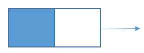
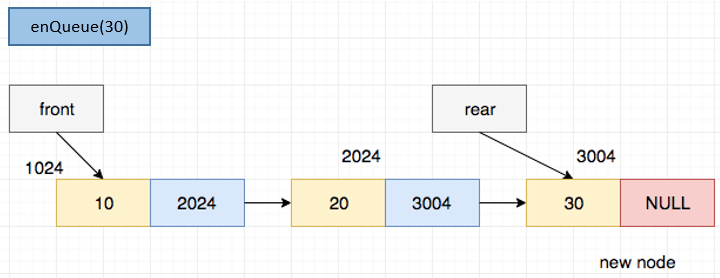
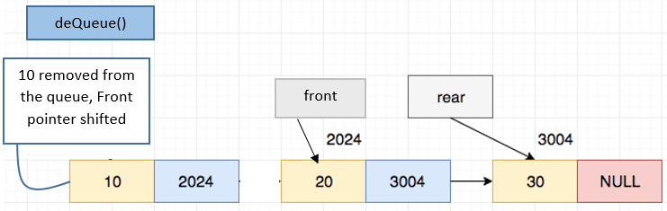

# ACM Foundations - Linked Lists, Stacks and Queues
# 1. Linked Lists
## 1.1 Why use Linked Lists?
Let us assume you are making a website and you need to record the names of customers who log in on the site. What size array would you use to store the data? If you select too small a size, then you will run out of space in the array. If you select a size too large you will be wasting space as much of it will be unused. It would be a lot more convenient if we could create a data-structure that could increase or decrease in size depending on how much data you wish to store in it. That is exactly what linked lists are designed for.

## 1.2 How do Linked Lists Work?
A linked list is made up of nodes, each node is a variable that keeps track of two values :
1. The value of the element in that node
2. A pointer to the next node in the list (NULL if it is the last node in the list)

The first node of the list is stored in a variable, generally termed 'head' or 'root'.
	
	
	
## 1.3 Linked List Implementation (Python 3.x)
First we need a node that can hold a value and the next node in the chain.

```python
class Node:
    def __init__(self, value = None):
        self.value = value
        self.next_ptr = None
```

Now let us make a simple class where we can add new elements to the list.
```python
class LinkedList:
    def __init__(self):
        self.root = None # no node when we create the list
        self.size = 0
    
    def insert_value(self, value):
        if self.root == None:
            self.root = Node(value)
            self.size += 1
            return
        
        curr_node = self.root
        while curr_node.next_ptr is not None:
            curr_node = curr_node.next_ptr

        curr_node.next_ptr = Node(value)
        self.size += 1
```

We can use this class to store email addresses of people who join the site as they come. This code will also print the number of elements in the list after it is created.
```python
emails = LinkedList()

while True:
    email_id = input("Enter an email id: ")
    if email_id == "":
        break
    
    emails.insert_value(email_id)

print("Number of email ids in the list:", emails.size)
```

If we want to print the elements in the list, we can copy the root and iterate over the list till we hit a null value.
```python
curr_node = emails.root

while curr_node is not None:
    print(curr_node.value)
    curr_node = curr_node.next_ptr
```

## 1.4 Problem : Number to Linked List
Take an integer as input and convert it to a linked list where each node is a digit of the number.

Note that if you try to simply insert the values into the list the number will end up reversed like this : 
```python
number = int(input("Enter a number: "))

ll = LinkedList()

while number != 0:
    digit = number % 10

    ll.insert_value(digit)

    number = int(number / 10)

curr_node = ll.root

while curr_node is not None:
    print(curr_node.value, end = " -> ")
    curr_node = curr_node.next_ptr
```

So to solve this issue we have two approaches : 
1. We create a function to insert an element at the start of a list rather than the end.
2. We reverse the list after creating it.

To implement code to add new elements to the start of the list, we can do something like this
```python
class LinkedList:
    def __init__(self):
        self.root = None # no node when we create the list
        self.size = 0
    
    def insert_value(self, value):
        if self.root == None:
            self.root = Node(value)
            self.size += 1
            return
        
        curr_node = self.root
        while curr_node.next_ptr is not None:
            curr_node = curr_node.next_ptr

        curr_node.next_ptr = Node(value)
        self.size += 1

    def insert_start(self, value):
        prev_root = self.root

        new_root = Node(value)
        new_root.next_ptr = prev_root

        self.root = new_root

number = int(input("Enter a number: "))

ll = LinkedList()

while number != 0:
    digit = number % 10

    ll.insert_start(digit)

    number = int(number / 10)

curr_node = ll.root

while curr_node is not None:
    print(curr_node.value, end = " -> ")
    curr_node = curr_node.next_ptr
```

## 1.5 Try it Yourself
Try writing the code to reverse the linked-list by yourself.


# 2. Stacks

## 2.1 What are Stacks?
Stacks are a data structure in which elements are inserted one after the other, and the most recent elements are removed first. For example, if we need to make a system where we analyze news articles and need to read the latest articles first before we look at old ones, stacks are perfect for this problem.


A stack has two main operations that we need to perform : 
1. Push : Adds a value to the stack
2. Pop : Removes a value from the stack

Other common operations are :
1. Top : Returns the value at the top of the stack
2. Size : Returns the number of elements in the stack
3. IsEmpty : True if the stack is empty

## 2.2 Stack Implementation (Python 3.x)

```python
class Stack:
    def __init__(self):
        self.root = None # no node when we create the list
        self.size = 0
    
    def push(self, value):
        '''
        Adds a value to the top of the stack.
        '''
        if self.root == None:
            self.root = Node(value)
            self.size += 1
            return
        
        curr_node = self.root
        while curr_node.next_ptr is not None:
            curr_node = curr_node.next_ptr

        curr_node.next_ptr = Node(value)
        self.size += 1

    def pop(self):
        '''
        Removes a value from the top of the stack
        '''

        if self.root == None:
          return None

        elif self.size == 1:
          val = self.root.value
          self.root = None
          self.size = 0
          return val

        curr_node = self.root
        # loop to find the 2nd last element in the stack and put it in curr_node
        while curr_node.next_ptr.next_ptr is not None:
            curr_node = curr_node.next_ptr
        
        val = curr_node.next_ptr.value # val = last element in the stack
        curr_node.next_ptr = None # delete the last element
        self.size -= 1
        return val
    
    def top(self):
        '''
        Returns the value from the top of the stack
        '''

        if self.root == None:
          return None

        elif self.size == 1:
          val = self.root.value
          return val

        curr_node = self.root
        # loop to find the 2nd last element in the stack and put it in curr_node
        while curr_node.next_ptr.next_ptr is not None:
            curr_node = curr_node.next_ptr
        
        val = curr_node.next_ptr.value # val = last element in the stack
        return val

    def isEmpty(self):
        '''
        True if the stack is empty. False otherwise.
        '''
        return self.size == 0
```

## 2.3 Problem : Valid Brackets

Write a program to check if a series of brackets are valid. 
Ex. 
1. [()()] is valid
2. [} is invalid
3. [(] is invalid


```python
string = input("Enter the brackets: ")


def isValidBrackets(string):
    stack = Stack()

    for char in string:
        if char == '(' or char == '{' or char == '[':
            stack.push(char)
        elif char == ')':
            val = stack.pop()

            if val == '(': # correct opening bracket for this closing bracket
                continue
            else:
                return False
        elif char == ']':
            val = stack.pop()

            if val == '[': # correct opening bracket for this closing bracket
                continue
            else:
                return False
        elif char == '}':
            val = stack.pop()

            if val == '{': # correct opening bracket for this closing bracket
                continue
            else:
                return False

    if stack.isEmpty(): # no remaining open brackets should be left in the stack
        return True
    else:
        return False
    

if isValidBrackets(string):
    print("Valid brackets.")
else:
    print("Invalid brackets.")
```

# 3. Leetcode

## 3.1 Introduction to Leetcode
[Leetcode](https://leetcode.com/) is currently the largest online platform where you can learn and practice coding interview style questions. These types of questions are largely based on data structures and algorithms and are also commonly seen in competitive programming contests.


## 3.2 Your First Problem
Let us try leetcode out with the above stack problem. [Valid Parentheses](https://leetcode.com/problems/valid-parentheses/) is an easy leetcode problem. Try pasting your solution to the problem from the code above and see the results! Keep in mind that as this code is not optimized, the execution speed will not be competitive. Try re-writing the code using native python lists to improve performance.


## 3.3 Asteroid Collision

We are given an array `asteroids` of integers representing asteroids in a row.

For each asteroid, the absolute value represents its size, and the sign represents its direction (positive meaning right, negative meaning left). Each asteroid moves at the same speed.

Find out the state of the asteroids after all collisions. If two asteroids meet, the smaller one will explode. If both are the same size, both will explode. Two asteroids moving in the same direction will never meet.

**Example 1:**

**Input:** asteroids = [5,10,-5]
**Output:** [5,10]
**Explanation:** The 10 and -5 collide resulting in 10. The 5 and 10 never collide.

**Example 2:**

**Input:** asteroids = [8,-8]
**Output:** []
**Explanation:** The 8 and -8 collide exploding each other.

**Example 3:**

**Input:** asteroids = [10,2,-5]
**Output:** [10]
**Explanation:** The 2 and -5 collide resulting in -5. The 10 and -5 collide resulting in 10.

**Constraints:**

- `2 <= asteroids.length <= 104`
- `-1000 <= asteroids[i] <= 1000`
- `asteroids[i] != 0`


**Explaination:**

Collision will only take place when the upcoming asteroid will be moving toward left and the prev asteroid is moving toward right otherwise collsion will not take place because they will not meet.


Hence we need to first check the condition wheter they are colliding or not. If the collision happens, then:

a) If the current asteroid is smaller than the one we saw earlier, it will explode, and the collision chain will stop there. 

b) if the current asteroid bigger, it will keep moving toward the left and might collide further with other asteroids we saw earlier that are moving toward the right. 

c) If the current asteroid is the same size as the one we saw earlier, both of them will explode and the collision chain will stop sinct the current stone is destroyed


Hence, the observation here is that each stone might keep colliding with asteroids on its left until it collides with a bigger asteroid or an asteroid of same size and explodes.

This requirement could be fulfilled by the **stack data structure***; if we keep asteroids in the stack, then for each asteroid, **the collision chain can be executed by checking the top of the stack and popping if an asteroid should be destroyed.**

The link for this question can be found [here](https://leetcode.com/problems/asteroid-collision/).

**Solution:**

```python
class Solution:
    def collision_check(self, m, n):
        if m > 0 and n < 0:
            return True
        else:
            return False

    def asteroidCollision(self, asteroids: List[int]) -> List[int]:
        final_asteroid = []
        for x in asteroids:
            asteroid_destroyed = False
            if not final_asteroid or not self.collision_check(final_asteroid[-1], x):
                final_asteroid.append(x)
            else:
                while final_asteroid and self.collision_check(final_asteroid[-1], x) and abs(final_asteroid[-1]) <= abs(x):
                    if abs(final_asteroid[-1]) == abs(x):
                        asteroid_destroyed = True
                        final_asteroid.pop()
                        break
                    final_asteroid.pop()
                if not asteroid_destroyed and (not final_asteroid or (final_asteroid and not self.collision_check(final_asteroid[-1], x))):
                    final_asteroid.append(x)

        return final_asteroid
        
```

# 4. Queues

## 4.1 What are Queues
A queue is a linear data structure in which insertions are done at one end (rear) and deletions are done at the other end (front). The first element to be inserted is the first one to be deleted. Hence, it's called as a First In First Out (FIFO) list.

A Queue is like a line waiting to purchase tickets, where the first person in line is the first person served. (i.e. First come first serve).


The queue has two pointers, **Front** and **Rear**. The front points towards the first element while the rear points towards the last element of the queue.

## 4.2 Queue Operations

1. `enQueue(int data)` :Inserts and element at the end of the queue. This operation adds a new node after the rear and moves the *rear pointer* to the new node added.

2. `deQueue()`: Removes and returns the elemnt at the front of the queue.This operation removes the front node and moves the *front pointer* to the next node.

3. `isEmpty()`: Indicates whether no elements are stored.

4. `front()`: Returns the element at the front withput removing it from the queue.

5. `QueueSize()`: Returns the number of elements stored in the queue.

## 4.3 Implementation of Queue using Linked List (Python 3.x)

First we'll define a class `Node` - A linked list node to store queue entry

```python
class Node:
 
    def __init__(self, data):
        self.data = data
        self.next = None
```



Then we define a class `Queue`. Its constructor will have 2 pointer: **Front and Rear**. Initially, since the queue is empty, Both of them point at `None`

```python
class Queue:
 
    def __init__(self):
        self.front = self.rear = None


```


**Defining EnQueue(item)**

```python
def EnQueue(self, item):
        temp = Node(item)
 
        if self.rear == None:
            self.front = self.rear = temp
            return
        self.rear.next = temp
        self.rear = temp
```

Case (a): When the Queue is initially empty


Case (b): When the Queue has some elements



**Defining DeQueue():**

```python
  def DeQueue(self):
 
        if self.isEmpty():
            return
        temp = self.front
        self.front = temp.next
 
        if(self.front == None):
            self.rear = None
```




**Defining isEmpty ():**

```python
    def isEmpty(self):
        return self.front == None
```

**Defining front():**

```python
def front(self):
    return self.front
```

## 4.4 Leetcode Question: Flatten Nested List Iterator

**Description:** You are given a nested list of integers `nestedList`. Each element is either an integer or a list whose elements may also be integers or other lists. Implement an iterator to flatten it. You can find the leetcode question [here](https://leetcode.com/problems/flatten-nested-list-iterator/).

Implement the `NestedIterator` class:

- `NestedIterator(List<NestedInteger> nestedList)` Initializes the iterator with the nested list `nestedList`.
- `int next()` Returns the next integer in the nested list.
- `boolean hasNext()` Returns `true` if there are still some integers in the nested list and `false` otherwise.

Your code will be tested with the following pseudocode:

```
initialize iterator with nestedList
res = []
while iterator.hasNext()
 append iterator.next() to the end of res
return res
```

If `res` matches the expected flattened list, then your code will be judged as correct.

**Example 1:**

**Input:** nestedList = [[1,1],2,[1,1]]
**Output:** [1,1,2,1,1]
**Explanation:** By calling next repeatedly until hasNext returns false, the order of elements returned by next should be: [1,1,2,1,1].

**Example 2:**

**Input:** nestedList = [1,[4,[6]]]
**Output:** [1,4,6]
**Explanation:** By calling next repeatedly until hasNext returns false, the order of elements returned by next should be: [1,4,6].

**Constraints:**

- `1 <= nestedList.length <= 500`
- The values of the integers in the nested list is in the range `[-106, 106]`.

**Assumptions:**

The question has already defines a **NestedInteger** class with the functions `isInteger()` , `getInteger()` and `getList()`.

We have to implement the **NestedIterator** class.

```python
# This is the interface that allows for creating nested lists.
# You should not implement it, or speculate about its implementation
# class NestedInteger(object):
#    def isInteger(self):
#        @return True if this NestedInteger holds a single integer, rather than a nested list.
#        :rtype bool
#    def getInteger(self):
#        @return the single integer that this NestedInteger holds, if it holds a single integer
#        Return None if this NestedInteger holds a nested list
#        :rtype int
#    def getList(self):
#       return the nested list that this NestedInteger holds, if it holds a nested list
#        Return None if this NestedInteger holds a single integer
#        :rtype List[NestedInteger]

class NestedIterator(object):
    def __init__(self, nestedList):
        """
        Initialize your data structure here.
        :type nestedList: List[NestedInteger]
        """
    def next(self):
        """
        :rtype: int
        """
    def hasNext(self):
        """
        :rtype: bool
        """
# Your NestedIterator object will be instantiated and called as such:
# i, v = NestedIterator(nestedList), []
# while i.hasNext(): v.append(i.next())
```


**Solution:**

*Basically, if you find an integer, add it to the queue or else if you find a nested list, use the function recursively to search for integers in that particular nested list and hence add it to the final queue.*


**Code:**

```python
import queue
class NestedIterator(object):

    def __init__(self, nestedList):
        self.flattenedList= queue.Queue()
        self.flatten(nestedList)

    def flatten(self , nestedList):
        for x in nestedList:
            if x.isInteger():
                self.flattenedList.put(x.getInteger()) 
            else:
                self.flatten(x.getList())   

    def next(self):
        return self.flattenedList.get()

    def hasNext(self):
        return not(self.flattenedList.empty())
```


